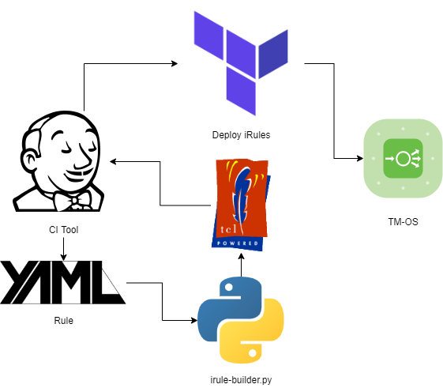

# F5 iRule Management

[](https://github.com/psf/black)

## Goal

Provide a declarative interface for designing and deploying common programmable logic to a virtual service.

## Overview

Python code will ingest a simplified (abstracted) YAML definition outlining desired programmability rules, and then leverage Terraform to deploy iRule to TM-OS appliance.



### Unit Testing

We want to construct *and automatically test* any non-factory (e.g. not provided by Jinja) capabilities to ensure quality is up to snuff. The approach here *MUST* be eminently testable.

Since F5 programmability rules have validation performed on import, the best way to perform testing would be to test deployment to an actual TM-OS appliance via a pipeline. We'll use Terraform to do that.

## HOWTO

### Automated method

* Clone this repository.
* Add rule definitions under `rules/`.
* Configure deployment rules under CI tool (examples will be provided)

### CLI method

```
python3 build-irule.py -i rule.yml -o rule.tcl
```

## Dependencies

* `cerberus`
* `jinja2`
* `JSON`
* `ruamel.YAML`
